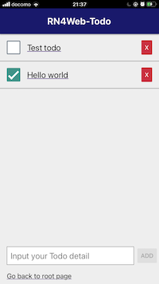
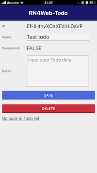

# react-native-for-web-todo

Excersize Todo app created with [React Native for Web](https://github.com/necolas/react-native-web) and stores data on Firebase Firestore.

 

This project was bootstrapped with [Create React App](https://github.com/facebook/create-react-app).

**Environment**

- Node v11.1.0
- npm 6.14.3

## How to setup

Since this app stores data on Firebase Firestore, you need to prepare your firebase project.

1. Go to [Firebase Console](https://console.firebase.google.com/)
2. Create a new project
3. Activate Web app, copy your firebase configs like apiKye, authDomain, etc. into .env file
4. Activate Cloud Firestore in Database section, enable it as development mode (Make sure you should take care of rules late since it is unsecure.

## How to run

Just type the command `$ npm start` in your console so that it navigates browser to `http://localhost:3000/`.

## How to deploy

If you want to deploy app to your Firebase Hosting, you can use Firebase CLI.

```console
$ npm run build
$ firebase init
  - set up for `Hosting`
  - Use existing project you created above
  - Use `build` as public directory
  - Configure as a sing-page app
  - Do not override index.html
$ firebase deploy --only hosting
```